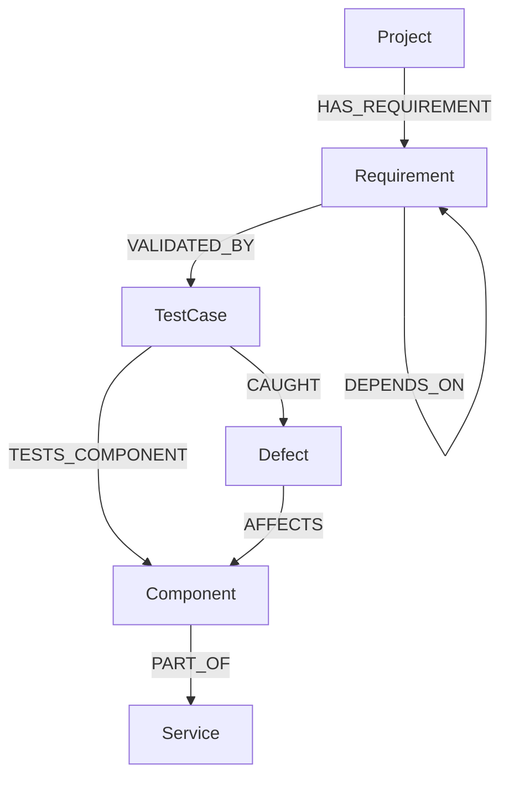

# TestGraph — Requirement Traceability & Impact Analysis

TestGraph answers a question every QA and engineering team eventually asks under pressure:
**"If we change or break this, what else breaks with it?"**

It models a software project's requirements, tests, components, services, and defects as a
graph, and lets a non-technical user (a QA lead, a PM, a support engineer) trace the blast
radius of any requirement in a few clicks — no SQL, no spreadsheets, no tribal knowledge.


---

## 1. The use case

A mid-size e-commerce team ships fast and things break in ways that are hard to predict from
a requirements document alone. Before merging a change to, say, the Authentication API, an
engineer needs to know: which requirements does this satisfy, which tests cover it, which
services depend on it, and which past defects touched it. TestGraph makes that traceability
chain a first-class, browsable part of the product instead of something scattered across
Jira, Confluence, and tribal memory.

**Primary workflow:**

```
Dashboard → Browse requirements → Select a requirement → View details
    → Analyze Impact → See affected tests / components / services / defects
```

## 2. Why a graph database?

The core question TestGraph answers — *"what does this requirement's change ripple into?"* —
is a **variable-depth traversal across five different relationship types**
(`HAS_REQUIREMENT`, `VALIDATED_BY`, `TESTS_COMPONENT`, `PART_OF`, `DEPENDS_ON`, `CAUGHT`,
`AFFECTS`). In a relational schema this becomes a chain of JOINs across `requirements`,
`test_cases`, `components`, `services`, `defects`, and a self-referential
`requirement_dependencies` join table — and the join count grows every time you add a new
hop (e.g. "what services are affected two levels of dependency away?"). In Neo4j/CognoDB the
same question is a single Cypher pattern with a variable-length path (`-[:DEPENDS_ON*1..5]->`),
independent of how many hops deep the traversal goes.

Two concrete places this shows up in TestGraph:

- **Multi-hop dependency chains** (`GET /api/requirements/{id}/dependency-chain`) — a
  relational version needs either a recursive CTE or N sequential queries; the graph version
  is one traversal.
- **Impact analysis** (`GET /api/requirements/{id}/impact`) — pulling together tests,
  components, services, *and* defects for a requirement in one call means walking four
  different relationship types from a single starting node. Modeling this relationally means
  either a wide multi-JOIN query that's awkward to reason about, or four separate round trips
  that the application layer has to stitch together itself.

## 3. Data model



**Nodes:** `Project`, `Requirement`, `TestCase`, `Component`, `Service`, `Defect`

**Relationships:**

| Relationship | From → To | Meaning |
|---|---|---|
| `HAS_REQUIREMENT` | Project → Requirement | project scope |
| `VALIDATED_BY` | Requirement → TestCase | which tests prove this requirement |
| `DEPENDS_ON` | Requirement → Requirement | requirement dependency chain (multi-hop) |
| `TESTS_COMPONENT` | TestCase → Component | what the test actually exercises |
| `PART_OF` | Component → Service | system architecture grouping |
| `CAUGHT` | TestCase → Defect | defects discovered by a test |
| `AFFECTS` | Defect → Component | components a defect impacts |


## 4. Tech stack

| Layer | Stack |
|---|---|
| Database | CognoDB (managed graph DB, openCypher over Bolt) |
| Backend | Python, FastAPI, official Neo4j Python driver |
| Frontend | React + Vite, Tailwind CSS, React Router |

## 5. Setup & run instructions

### 5.1 Provision CognoDB

1. Sign up at [console.cognodb.com](https://console.cognodb.com/signup) (free, no card required).
2. Create a free `c0` instance and pick a region — provisions in under a minute.
3. Copy the connection URI (`bolt+s://<instance-id>.databases.cognodb.cloud`) and the
   generated password for user `cognodb`. **The password is shown once** — save it now.

### 5.2 Backend

```bash
cd backend
python -m venv venv
source venv/bin/activate   # Windows: venv\Scripts\activate
pip install -r requirements.txt
```

Create `backend/.env`:

```env
COGNODB_URI=bolt+s://<instance-id>.databases.cognodb.cloud
COGNODB_USER=cognodb
COGNODB_PASSWORD=<your-generated-password>
```

Seed the database, then start the API:

```bash
python -m app.graph.seed
uvicorn app.main:app --reload
```

Confirm it's healthy: open `http://localhost:8000/health` and `http://localhost:8000/docs`.

### 5.3 Frontend

```bash
cd frontend
cp .env.example .env   # set VITE_API_BASE_URL if the backend isn't on localhost:8000
npm install
npm run dev
```

Open `http://localhost:5173`.

## 6. Main queries, explained

**Multi-hop traversal** — `dependency-chain` endpoint:

```cypher
MATCH (r:Requirement {id: $requirement_id})-[:DEPENDS_ON*1..5]->(dep:Requirement)
RETURN dep
```

Walks the `DEPENDS_ON` chain up to 5 hops deep from a starting requirement — the exact case
where a relational schema would need a recursive CTE instead of one pattern.

**Awkward-for-relational query** — `impact` endpoint:

```cypher
MATCH (r:Requirement {id: $requirement_id})-[:VALIDATED_BY]->(t:TestCase)
OPTIONAL MATCH (t)-[:TESTS_COMPONENT]->(c:Component)-[:PART_OF]->(s:Service)
OPTIONAL MATCH (t)-[:CAUGHT]->(d:Defect)-[:AFFECTS]->(ac:Component)
RETURN
  collect(DISTINCT t)  AS test_cases,
  collect(DISTINCT c)  AS components,
  collect(DISTINCT s)  AS services,
  collect(DISTINCT d)  AS defects,
  collect(DISTINCT ac) AS affected_components
```

Both queries are executed with parameters (`$requirement_id`) via the official Neo4j driver —
no string-concatenated Cypher anywhere in the codebase.

## 7. Environment variables

| Variable | Where | Purpose |
|---|---|---|
| `COGNODB_URI` | `backend/.env` | Bolt connection URI |
| `COGNODB_USER` | `backend/.env` | Database user (`cognodb`) |
| `COGNODB_PASSWORD` | `backend/.env` | Generated instance password |
| `VITE_API_BASE_URL` | `frontend/.env` | URL the frontend calls for the FastAPI backend |

None of these are committed — see `.gitignore` in both `backend/` and `frontend/`.

